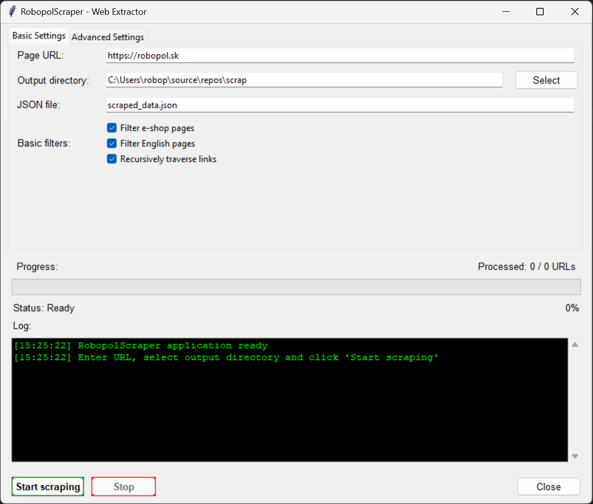

# Web Scraper with GUI

A Python application for scraping websites with a user-friendly GUI interface. This tool allows you to extract data from websites, save HTML content of pages, and generate structured JSON output with metadata.



## Features

- Extract links, headings, images, and metadata from websites
- Save complete HTML content of each page
- Generate structured JSON output with all scraped data
- User-friendly GUI with progress tracking
- Support for dynamic content through Selenium (optional)
- Filter out e-shop pages and specific language versions
- Recursive link traversal with configurable depth
- Custom regex pattern filtering for URLs
- Image downloading capability with organized storage
- Real-time progress updates and detailed logging
- Configurable request delays to avoid overloading servers

## Requirements

- Python 3.6+
- Required Python packages:
  - beautifulsoup4
  - requests
  - pandas
  - tkinter
  - selenium (optional, for dynamic content)
  - webdriver-manager (if using selenium)

## Installation

1. Clone the repository:
```bash
git clone https://github.com/robopol/webscraper.git
cd webscraper
```

2. Install required packages:
```bash
pip install -r requirements.txt
```

## Usage

### GUI Application

Run the application with the GUI interface:

```bash
python main.py
```

In the GUI:
1. Enter the base URL of the website to scrape
2. Choose an output directory for HTML files
3. Specify a filename for the JSON output
4. Configure filtering options in Basic Settings tab
5. Set advanced options in Advanced Settings tab (optional)
6. Click "Start Scraping"
7. View progress in the log window

### Basic Settings

- **Page URL**: Starting URL for the scraper
- **Output directory**: Where to save HTML files and JSON data
- **JSON file**: Name of the output JSON file
- **Basic filters**:
  - Filter e-shop pages: Skip online store pages
  - Filter English pages: Skip English versions of pages
  - Recursively traverse links: Follow links to discover more pages

### Advanced Settings

- **Delay**: Add delay between requests (0-10 seconds)
- **URL filters**: Include or exclude URLs using regex patterns
- **Image downloading**: Enable downloading of images from pages
  - Custom directory for storing downloaded images

### Command-line Use

You can also use the scraper directly from the command line:

```bash
python scraper.py
```

## Output

The scraper generates several types of output:

1. **HTML files**: Complete HTML content of each page, saved in the specified output directory
2. **JSON file**: Structured data including:
   - Page URL
   - Title
   - HTML file path
   - Content snippet
   - List of downloaded images (if enabled)
3. **Images**: Downloaded images from pages (when enabled), organized by page

## Technical Details

The application is structured in three main components:

1. **RobopolScraper class** (`scraper.py`): Core scraping engine that handles:
   - URL filtering and validation
   - HTML content extraction
   - Link discovery and traversal
   - Image downloading
   - Data structuring and storage

2. **ScraperGUI class** (`gui.py`): User interface that provides:
   - Configuration options
   - Progress tracking
   - Status updates
   - Logging
   - Background processing via threading

3. **Main application** (`main.py`): Entry point that initializes the GUI

## Customization

You can customize the scraper by modifying the following parameters:

- Filter keywords for e-shop pages
- Filter keywords for specific language versions
- Custom regex patterns for including/excluding URLs
- Output directory structure
- Request delays
- Image downloading options

## Contributing

Contributions are welcome! Please feel free to submit a Pull Request.

## License

This project is licensed under the MIT License - see the LICENSE file for details. 
